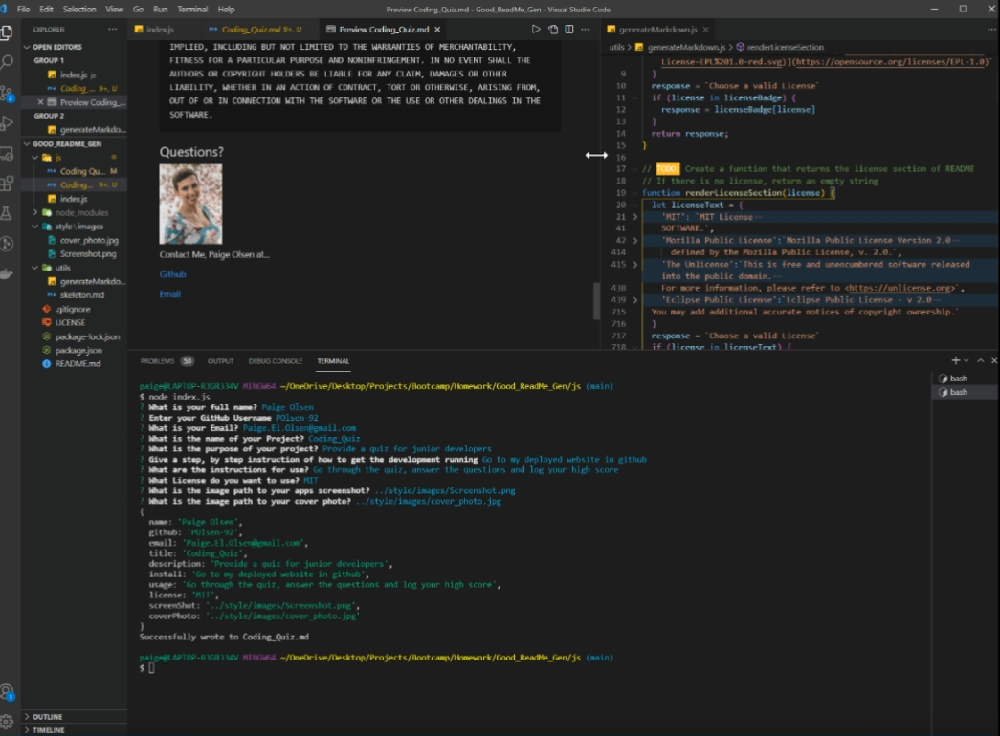

# 09 Professional README Generator
[](https://opensource.org/licenses/MIT)

## Description
feature project 1 in this course along with 3 other homework assignments. For the work features the photos 
<pre>
	The goal for this project was to utilize our understanding of node and command line applications which 
accept user input. To complete the assignment we had to create a number of command line prompts which would
log our response and then input them into their proper place within a markdown skeleton using Javascript.

	Thus, creating a concise, professional ReadMe for developers to use. This app is designed to decrease
the amount of time a developer needs to take on producing a readme and can also be used to get responses 
from developers that contributed to a project.

	Below you can see an image link which will take you to a video walkthrough of the ReadMe generator so you 
can see how it works and try it for yourself. There are several licenses to choose from and more can easily 
be added using the key, value based function that I used. By giving your Github username and email the 
generator will create working links. If one wants to provide a personal photo and screenshot of their app
they can also do so. Once the markdown document is created it will be named based off the title you gave 
the project so that it can be easily found and all of the links within the table of contents work.

</pre>

## Homework Requirements

```md
GIVEN a command-line application that accepts user input
WHEN I am prompted for information about my application repository
THEN a high-quality, professional README.md is generated with the title of my project and sections entitled Description, Table of Contents, Installation, Usage, License, Contributing, Tests, and Questions
WHEN I enter my project title
THEN this is displayed as the title of the README
WHEN I enter a description, installation instructions, usage information, contribution guidelines, and test instructions
THEN this information is added to the sections of the README entitled Description, Installation, Usage, Contributing, and Tests
WHEN I choose a license for my application from a list of options
THEN a badge for that license is added near the top of the README and a notice is added to the section of the README entitled License that explains which license the application is covered under
WHEN I enter my GitHub username
THEN this is added to the section of the README entitled Questions, with a link to my GitHub profile
WHEN I enter my email address
THEN this is added to the section of the README entitled Questions, with instructions on how to reach me with additional questions
WHEN I click on the links in the Table of Contents
THEN I am taken to the corresponding section of the README
```

## Video of ReadMe Generator

<a href="https://drive.google.com/file/d/1fa_SsJXRPOx71Fzyj10yORrm9J1CvMuF/view?usp=sharing" title="Walk-Through"></a>

## Credits
Built with [Javascript](https://www.javascript.com/)

NPMs used [Inquirer](https://www.npmjs.com/package/inquirer) and [Fs](https://www.npmjs.com/package/file-system)

## License

MIT License

    Copyright (c) [2021] [Paige Olsen]
    
    Permission is hereby granted, free of charge, to any person obtaining a copy
    of this software and associated documentation files (the "Software"), to deal
    in the Software without restriction, including without limitation the rights
    to use, copy, modify, merge, publish, distribute, sublicense, and/or sell
    copies of the Software, and to permit persons to whom the Software is
    furnished to do so, subject to the following conditions:
    
    The above copyright notice and this permission notice shall be included in all
    copies or substantial portions of the Software.
    
    THE SOFTWARE IS PROVIDED "AS IS", WITHOUT WARRANTY OF ANY KIND, EXPRESS OR
    IMPLIED, INCLUDING BUT NOT LIMITED TO THE WARRANTIES OF MERCHANTABILITY,
    FITNESS FOR A PARTICULAR PURPOSE AND NONINFRINGEMENT. IN NO EVENT SHALL THE
    AUTHORS OR COPYRIGHT HOLDERS BE LIABLE FOR ANY CLAIM, DAMAGES OR OTHER
    LIABILITY, WHETHER IN AN ACTION OF CONTRACT, TORT OR OTHERWISE, ARISING FROM,
    OUT OF OR IN CONNECTION WITH THE SOFTWARE OR THE USE OR OTHER DEALINGS IN THE
    SOFTWARE.

## Creator

 <br>
Paige Olsen
[Github](https://github.com/POlsen-92) ,
[LinkedIn](https://www.linkedin.com/in/paige-olsen-2aba9685/)
